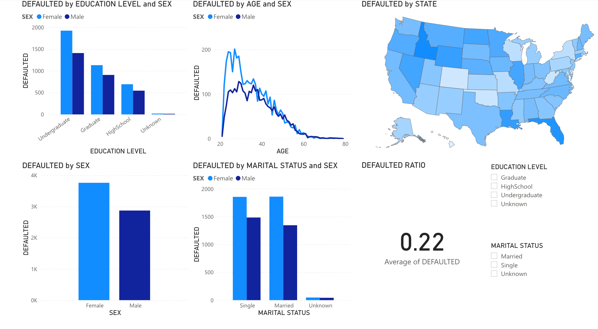

# Credit Default Dashboard
Using Power BI to analyze credit data trends 

## Overview
This exercise saught to investigate trends for a fictional bank with regards to credit card defaults. CSV data from bank customers was used to determine whether or not insights could be drawn through visualizations via Power BI. An interactive dashboard was created that provides the ability to filter based on a variety of demographic variables such as gender, education level, geographic location, etc. 

### Resources
  * CSV files
  * Power BI

### Dashboard Image:

